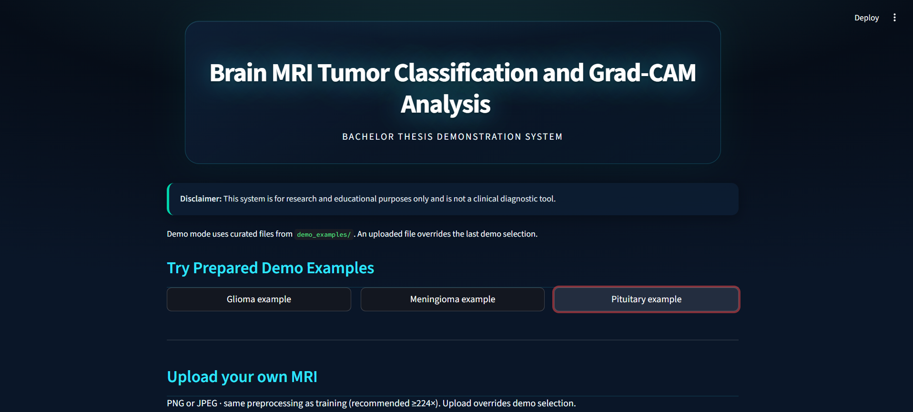
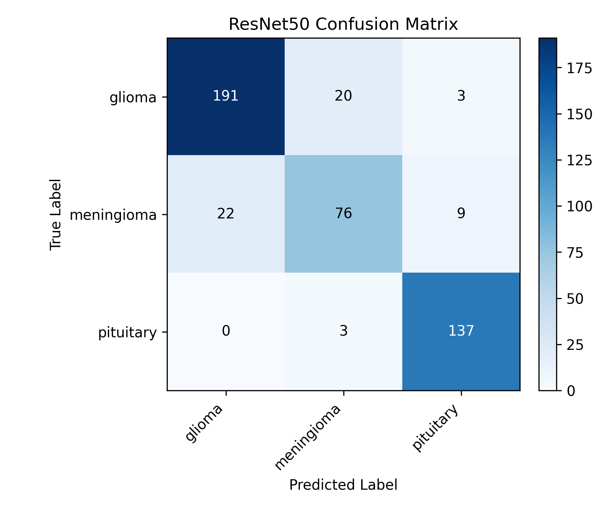
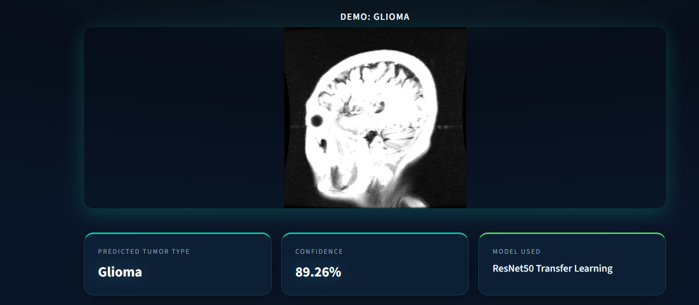
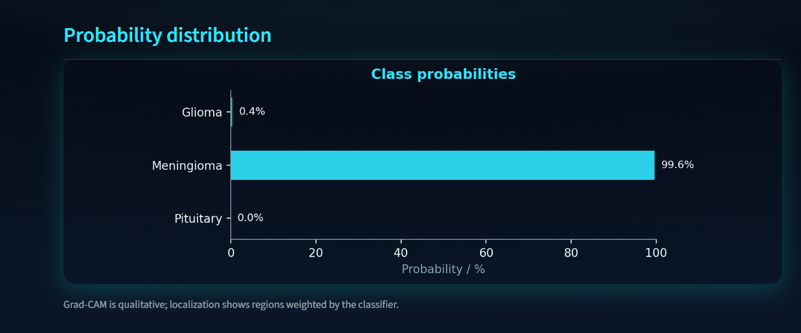
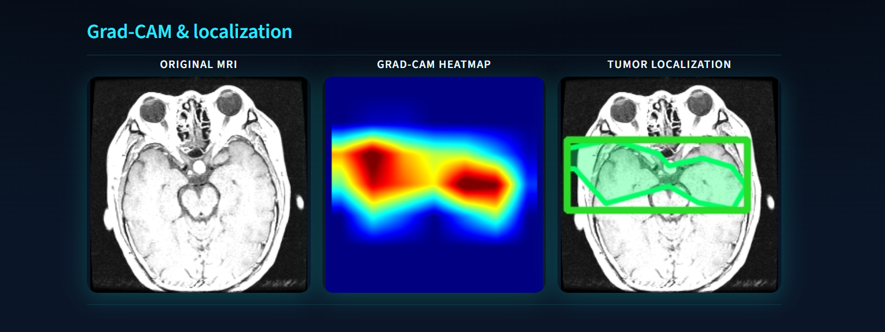
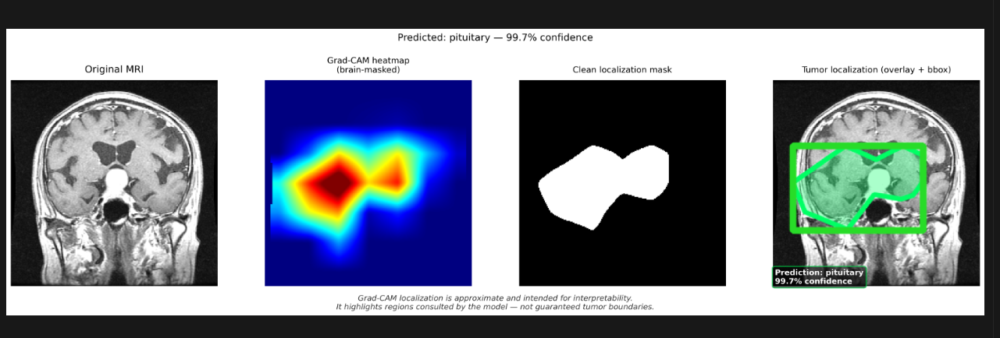

# Brain MRI Tumor Classification and Grad-CAM Analysis

Bachelor thesis project — **Sarajevo School of Science and Technology (SSST)**

---

## 1. Overview

This repository implements a deep learning pipeline for **three-class categorization** of brain MRI appearances associated with tumor types commonly studied in imaging benchmarks: **glioma**, **meningioma**, and **pituitary**. The work focuses on **computer-aided pattern recognition** for research and coursework: training reproducible models, reporting quantitative results, and illustrating **where** a convolutional network attends via **Grad-CAM**—not on replacing radiologists or clinical workflows.

---

## 2. Key Features

- **ResNet50 transfer learning** with a custom classification head and a staged fine-tuning routine (`train_resnet50.py`).
- **Baseline CNN** for comparison (`train_model.py`, `evaluate_model.py`).
- **Grad-CAM heatmaps** and optional **localization-style overlays** for qualitative interpretability (`utils/gradcam.py`, `tumor_localization.py`, `gradcam_visualization.py`).
- **Streamlit web demo** with curated examples and user uploads (`app.py`).
- **CLI utilities** for quick inference and figure export (`demo_predict.py`, dataset scripts).
- **Structured outputs**: metrics, confusion matrices, training curves, and thesis-ready figures under `outputs/`.

---

## 3. Technologies Used

| Area | Stack |
|------|--------|
| Deep learning | TensorFlow / Keras |
| App | Streamlit |
| Vision / I/O | OpenCV (headless), Pillow |
| Numerics & ML utilities | NumPy, pandas, scikit-learn |
| Visualization | Matplotlib |

---

## 4. Dataset

Training follows Keras **`image_dataset_from_directory`** conventions: **one subdirectory per class** (alphabetical order aligns with softmax indices). Expected layout:

```
data/dataset/
├── train/
│   ├── glioma/
│   ├── meningioma/
│   └── pituitary/
├── val/
│   └── ...
└── test/
    └── ...
```

Optional preprocessing helpers (`convert_dataset.py`, `preprocess_dataset.py`) support preparing data from other formats into this structure. **Dataset composition, splits, and ethics of use** should be described in the thesis document; this README does not replicate clinical provenance.

---

## 5. Model Architecture

The **primary model** is **ResNet50** pretrained on ImageNet, with the top replaced by a head suited to three-way softmax classification. Training uses **transfer learning**: first fitting the head while the backbone is largely frozen, then **fine-tuning** upper layers of the backbone with a smaller learning rate. A simpler **CNN baseline** is included for pedagogical contrast.

---

## 6. Grad-CAM Explainability

**Grad-CAM** highlights spatial regions that contribute to the model’s predicted class. In this project it serves **qualitative explainability** only:

- It does **not** produce ground-truth tumor boundaries or segmentation masks suitable for clinical decisions.
- Maps depend on model weights, preprocessing, and post-processing (e.g., masking, thresholds); they should be interpreted **critically** alongside formal metrics and domain expertise.

---

## 7. Streamlit Demo Application

The Streamlit app (`app.py`) runs inference with the trained ResNet50 weights and visualizes **class probabilities**, **Grad-CAM**, and a **localization-style overlay** derived from the heatmap pipeline.

- **Demo mode**: predefined PNGs under `demo_examples/` (glioma / meningioma / pituitary).
- **Upload**: users may upload their own images for offline experimentation (same preprocessing as training).

The UI is intended for **demonstration and education**, not patient-facing screening.

---

## 8. Results

On the held-out **test** split used in this thesis, the **ResNet50** model achieved approximately **95% accuracy** (exact figures, confusion matrix, and per-class metrics are saved under `outputs/metrics/` and should be cited from your runs). Results **vary** with data splits, preprocessing, and hardware; reproduce using the training script and report your own numbers in defense materials.

---

## 9. Project Structure

```
project/
├── app.py
├── train_resnet50.py
├── train_model.py
├── evaluate_model.py
├── tumor_localization.py
├── demo_predict.py
├── gradcam_visualization.py
├── gradcam_batch_visualization.py
├── analyze_dataset.py
├── convert_dataset.py
├── preprocess_dataset.py
├── main.py
├── requirements.txt
├── README.md
├── models/                 # Trained .keras weights (not always committed)
├── data/
│   ├── dataset/            # train / val / test (folder-per-class)
│   └── processed/
├── demo_examples/          # Streamlit demo images + README
├── outputs/
│   ├── figures/
│   ├── metrics/
│   └── final_results/
├── screenshots/            # Thesis / README figures
├── docs/
│   ├── poster/
│   └── thesis_figures/
└── utils/                  # Paths, preprocessing, Grad-CAM, plots
```

---

## 10. Installation

Python 3.10+ recommended. From the repository root:

```bash
python -m venv .venv
```

**Windows (PowerShell):**

```powershell
.\.venv\Scripts\activate
pip install -r requirements.txt
```

**Linux / macOS:**

```bash
source .venv/bin/activate
pip install -r requirements.txt
```

Place trained weights (e.g. `models/resnet50_model.keras`) in `models/` before running demos if they are not generated locally.

---

## 11. Usage

**Launch the Streamlit demo:**

```bash
streamlit run app.py
```

**Single-image prediction (CLI):**

```bash
python demo_predict.py --image demo_examples/glioma.png
```

**Single-image Grad-CAM / localization figure (example):**

```bash
python tumor_localization.py --single --image demo_examples/glioma.png --model models/resnet50_model.keras
```

**Other entry points (see scripts for arguments):**

| Task | Command |
|------|---------|
| Train ResNet50 | `python train_resnet50.py` |
| Train baseline CNN | `python train_model.py` |
| Evaluate baseline | `python evaluate_model.py` |
| Batch localization panels | `python tumor_localization.py` |
| Grad-CAM figure (one test sample) | `python gradcam_visualization.py` |

---

## 12. Screenshots

Add these images under `screenshots/` for the README to render on GitHub:













---

## 13. Disclaimer

This software is provided **for research and educational purposes only**. It is **not** a medical device, **not** validated for clinical use, and **must not** be used to diagnose, treat, or triage patients. Any resemblance to clinical workflow here is illustrative. Human experts and approved protocols remain essential for medical decisions.

---

## 14. Future Work

- External validation on independent cohorts and clearer reporting of uncertainty.
- Stronger calibration of probabilities and failure-mode analysis (e.g., out-of-distribution inputs).
- Comparison with additional architectures and explainability methods beyond Grad-CAM.
- Packaging and documentation aligned with reproducibility standards (seeds, environment locks, public dataset citations).

---

## 15. Author

**Emina Karalic**  
Bachelor thesis — *Brain MRI Tumor Classification and Grad-CAM Analysis*  
**Sarajevo School of Science and Technology (SSST)**


